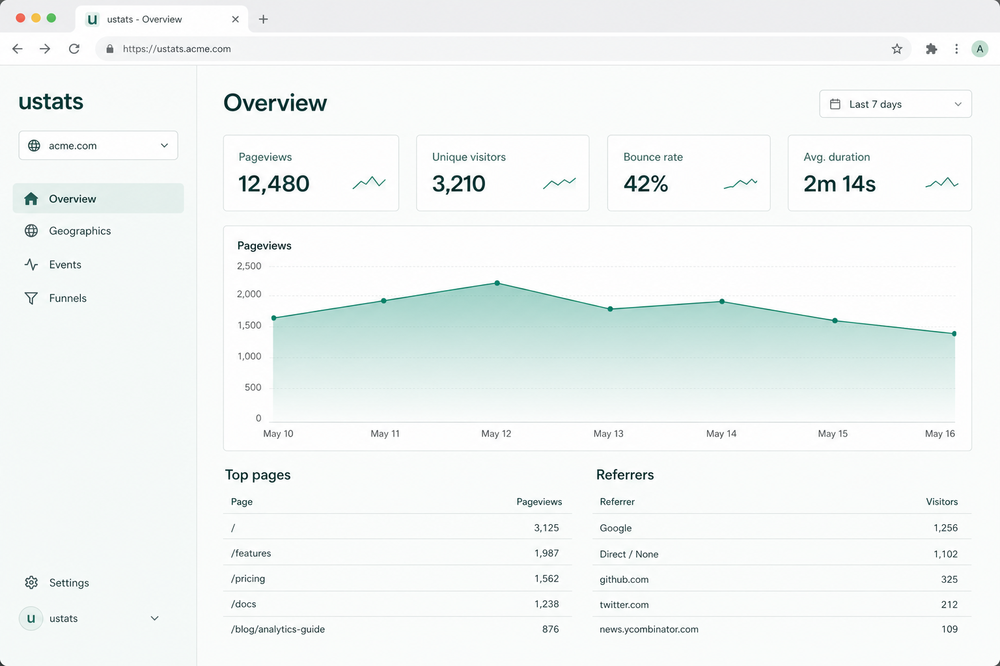

# ustats

Self-hosted, privacy-friendly web analytics on **your** Supabase project.

Open-source alternative to Plausible / a.st — pageviews, unique visitors, top pages, referrers, countries/devices, UTMs, custom events, and a realtime live feed.

[](LICENSE)
[](https://nodejs.org/)



## Stack

- Next.js (App Router)
- Supabase (Postgres, Auth, Realtime)
- Cookie-free tracking (daily salted visitor hash by default; raw IPs are not stored)

## Requirements

- Node.js 20+
- A Supabase project
- A host that can run Next.js (Vercel is the primary path; any Node host works)

## Quick start

### 1. Create a Supabase project

In the [Supabase dashboard](https://supabase.com/dashboard), create a project and note:

- Project URL
- `anon` (public) key
- `service_role` key (server only — never expose in the browser)

### 2. Apply the database migrations

Apply **all** migrations under `supabase/migrations/` (there are many files after `init` — do not paste only the first SQL file):

```bash
npm install
npx supabase link --project-ref YOUR_PROJECT_REF
npx supabase db push
```

Enable **Realtime** for the `events` table if the migration did not already add it (Dashboard → Database → Publications).

### 3. Configure environment

```bash
cp .env.example .env.local
```

Fill in:

| Variable | Purpose |
|----------|---------|
| `NEXT_PUBLIC_SUPABASE_URL` | Supabase project URL |
| `NEXT_PUBLIC_SUPABASE_ANON_KEY` | Public anon key |
| `SUPABASE_SERVICE_ROLE_KEY` | Service role key (collector inserts + bootstrap) |
| `USTATS_HASH_SALT` | Long random string for visitor hashing |
| `NEXT_PUBLIC_APP_URL` | Public URL of this install (for embed snippets) |
| `USTATS_MODE` | Optional — `app` (default) serves login/dashboard at `/`; set `marketing` for the public landing + docs site |
| `OPENAI_API_KEY` | Optional — enables the dashboard AI assistant |
| `DISABLE_SIGNUP` | Set to `true` to hide/reject public sign up (recommended for self-host) |
| `USTATS_BOOTSTRAP_EMAIL` | Optional — email for the first admin when Auth has no users |
| `USTATS_BOOTSTRAP_PASSWORD` | Optional — password for that first admin (min 6 chars) |
| `USTATS_RECOVERY_PHRASE` | Optional — phrase to reset password while signed in (Settings → Security) |

Full reference: [Environment variables](https://ustats.dev/docs/environment-variables) (or `/docs/environment-variables` on a marketing-mode install).

In Supabase Auth settings, add your app URL to **Redirect URLs** (e.g. `http://localhost:3000/auth/callback`). For self-host, also turn off **Enable sign ups** under Authentication → Providers → Email, and use bootstrap env vars (or the Auth dashboard) to create the first user.

### 4. Run the app

```bash
npm run dev
```

Open [http://localhost:3000](http://localhost:3000) — you’ll land on sign-in (or the dashboard if already authenticated). Add a site and copy the embed snippet. After the first user exists, remove the bootstrap env vars.

The landing page, docs, and SEO pages are only served when `USTATS_MODE=marketing` (used for the public project site). Self-host installs leave this unset.

### 5. Embed the tracker

```html
<script defer data-key="YOUR_SITE_PUBLIC_KEY" src="https://your-ustats-host/script.js"></script>
```

Custom events:

```js
ustats.track("signup", { plan: "pro" });
```

SPA route changes are tracked automatically via `history.pushState` / `popstate`.

## Deploy (Vercel + Supabase)

Step-by-step production guide: [Deploying](https://ustats.dev/docs/deploying) (or `/docs/deploying` on a marketing-mode install).

Short version:

1. Create a Supabase project, run `npx supabase db push`, enable Realtime on `events`, and set Auth Site URL / Redirect URLs to `https://your-host/auth/callback`.
2. Import the repo on [Vercel](https://vercel.com/new), set the env vars from `.env.example` (including `DISABLE_SIGNUP=true` for self-host), and leave `USTATS_MODE` unset.
3. Bootstrap the first admin with `USTATS_BOOTSTRAP_EMAIL` / `USTATS_BOOTSTRAP_PASSWORD` (or create the user in the Auth dashboard), sign in, then remove the bootstrap vars.
4. Point `NEXT_PUBLIC_APP_URL` at the production URL and embed `script.js`.

Geo country codes are read from CDN headers when available (`x-vercel-ip-country`, `cf-ipcountry`). Any Node host that can run Next.js also works — same env vars.

## Architecture

```
Browser  --script.js-->  POST /api/collect  -->  Supabase (service role insert)
Owner    --dashboard-->  Supabase Auth + RLS select on events
Live UI  <--Realtime---  postgres_changes on events
```

- Collector validates the site `public_key` and domain, drops obvious bots, hashes IP+UA with a daily salt (or a stable salt if cross-day tracking is enabled for the site), and stores the event.
- Dashboard users only see sites they belong to (`site_members` + RLS). Guests assigned as site viewers are read-only; staff and site owners/admins can change site configuration.
- No direct client inserts on `events` — only the service role collector writes.

## Roles (self-host)

| Instance role | Access |
|---------------|--------|
| **Admin** | Full control: sites, users, settings |
| **Co-Admin** | Manage sites and guest users; cannot create other Co-Admins |
| **Guest** | Read-only dashboards for sites they are assigned to |

Create additional users under **Settings → Users** (staff only). Email invites are not implemented yet — operators set email + password.

## v0.1 known limitations

ustats `0.1.0` is a self-host MVP. Expect:

- **Primary deploy path:** Vercel + Supabase (no official Docker image yet)
- **Team access:** staff-managed accounts only (no email invites / magic links)
- **No public share links** for dashboards yet
- **Experimental features** (custom graphs, feature analytics, DOCX reports) exist in the codebase but are off by default
- **Login rate limiting** is in-memory (fine for a single Node process; weaker across many serverless instances)
- See the [roadmap](https://ustats.dev/roadmap) for share links, goals, digests, and more

## Contributing

See [CONTRIBUTING.md](CONTRIBUTING.md). Security reports: [SECURITY.md](SECURITY.md).

## Local development notes

- Changing `USTATS_HASH_SALT` or waiting past UTC midnight changes visitor identity when cross-day tracking is off (by design). Per-site Settings can enable durable visitor hashes; that typically requires a consent banner.
- For production, generate a strong `USTATS_HASH_SALT` and keep the service role key server-side only.
- Use `npm` (this repo ships `package-lock.json`).

## License

MIT
